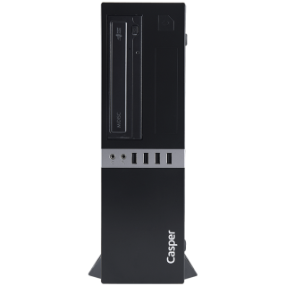

# Casper M500  | Intel i5 (9. Nesil)

Türkçe | [English](https://github.com/sutsurup/MONSTER-Hackintosh/blob/master/README_EN.md)

**macOS Versiyonu: 11.0**

**OpenCore Versiyonu: 0.6.5**

Yardımcı olabilecek kaynaklar: 

- [OpenCore Yükleme Rehberi](https://dortania.github.io/OpenCore-Install-Guide)

# Detaylar

    Tarih:        Ocak 20, 2021
    Durum:        Stabil
    Destek:       BIOS (5.12)
    Yapı:         OpenCore

## Donanım

| **MONSTER** | Detay                                                  |
| ------------------- | ------------------------------------------- |
| Model Ismi      | Casper M500      |
| Anakart           | 	Intel Kaby Point H310C     |
| CPU              | Intel(R) Core(TM) i5-9400 CPU @ 2.90GHz (max. 4.10GHz) Coffee Lake-S              |
| RAM           | Kingston 4GB+4GB (9905713-019.A00G) 2666 MHz DDR4 SDRAM   |
| Dahili Grafik Kartı | Intel(R) UHD Graphics 630 (1 GB)                     |
| Ses       | Realtek ALC662                        |
| BIOS Versiyonu      | 5.12                   |

## Uyumluluk
**macOS Big Sur 11.0** sürümünü desteklemektedir.
Releases bölümünde paylaştığım EFI klasörünü, macOS kurulum belleğinizdeki EFI için ayrılan bölüme kopyalayınız.
macOS High Sierra 10.13.6, Mojave 10.14.6 veya Catalina 10.15.7 sürümlerinde çalıştırmayı deneyebilirsiniz

# Kurulum sonrası yararlanabileğiniz rehber/araçlar (Isteğe bağlı)
* önerilir: iCloud'a giriş yapacaksanız veya iMessage, FaceTime kullanmak istiyorsanız, bu rehberi harfiyen uygulayın: [OpenCore ile iMessage ve Apple Servislerini Aktif Etmek](https://osxinfo.net/konu/opencore-ile-imessage-ve-apple-servislerini-aktif-etmek.16297/) (Bu rehberde Clover Configurator gösterilmiş, siz OpenCore Configurator kullanacaksınız, Clover Configurator üzerinden takip edin, verileri OpenCore Configurator aracılığıyla config.plist dosyanıza girin)
* [ProperTree](https://osxinfo.net/konu/propertree-opencore-bootloader-icin-config-duzenleyici.12919/) (config.plist düzenlemek için)
* Hackintool ([Forum thread](https://www.insanelymac.com/forum/topic/335018-hackintool-v286/) | [Direkt indirme linki](http://headsoft.com.au/download/mac/Hackintool.zip)) (Detaylı sistem bilgileri öğrenme ve düzenlemeleri için)
* Hackintool ([Indir](https://github.com/headkaze/Hackintool/releases/tag/3.5.3)

## İletişime geçin
Website: https://sutsurup.com //
Mail: [contact@sutsurup.com](contact@sutsurup.com)

## Ekran Görüntüleri

BigSur

Kolay gelsin!
