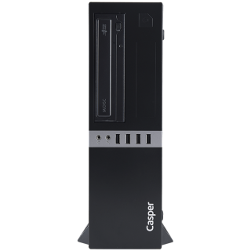
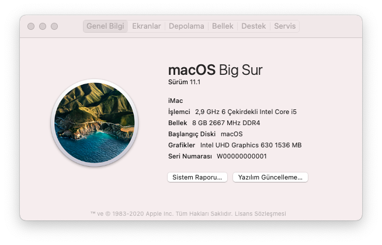
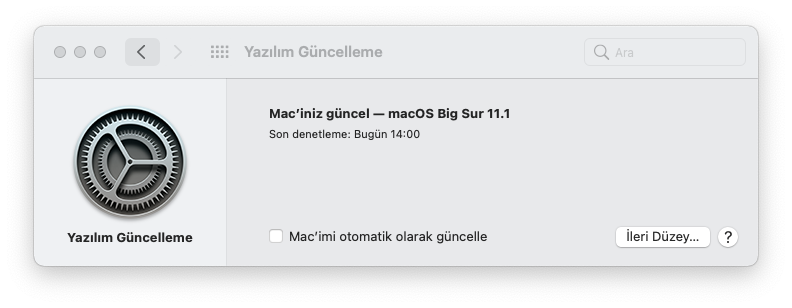
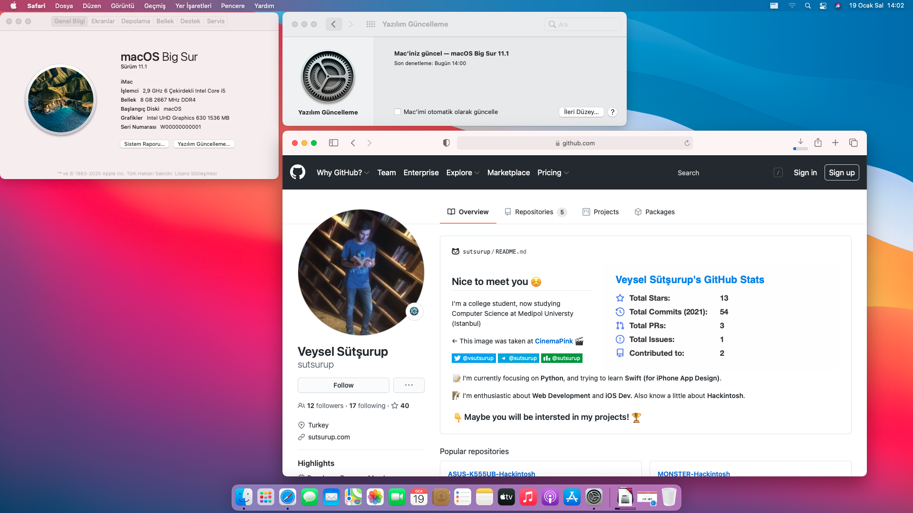

# Casper M500  | Intel i5 (9th Gen)

[](https://www.apple.com/tr/macos/big-sur/)
[](https://github.com/acidanthera/OpenCorePkg)
[](https://github.com/sutsurup/CASPER-M500-Hackintosh/releases)



[Türkçe](README.md) | English

**macOS Version: 11.1**

**OpenCore Version: 0.6.5**

Helpful resources:

- [OpenCore Install Guide](https://dortania.github.io/OpenCore-Install-Guide)


# Details

    Date:         January 20, 2021
    Status:       Stable
    Support:      BIOS (5.12)
    Build:        OpenCore


## Hardware

| **CASPER** | Details                                                  |
| ------------------- | ------------------------------------------- |
| Model Name      | Casper M500      |
| Motherboard           | 	Intel Kaby Point H310C     |
| CPU              | Intel(R) Core(TM) i5-9400 CPU @ 2.90GHz (max. 4.10GHz) Coffee Lake-S              |
| RAM           | Kingston 4GB+4GB (9905713-019.A00G) 2666 MHz DDR4 SDRAM   |
| Integrated GPU | Intel(R) UHD Graphics 630 (1 GB)                     |
| Audio       | Realtek ALC662 (Layout: 13)                        |
| BIOS Version      | 5.12                   |



## Compatibility
Supports **macOS Big Sur 11.1**.
I shared a zip file for the EFI folder in the Releases section. On your macOS installation media's EFI partition, create a folder named `EFI` and copy the `BOOT` and `OC` folders from the zip into that `EFI` folder.
You can also try running macOS High Sierra 10.13.6, Mojave 10.14.6 or Catalina 10.15.7.

### Working

- [x] Sleep
- [x] Ethernet (patched)
- [x] Audio (Layout: 13)

### Not working (yet)
- [ ] Display brightness



# Post-install helpful guides/tools (optional)
* Recommended if you plan to sign into iCloud or use iMessage/FaceTime: follow this guide exactly: [Enable iMessage and Apple Services with OpenCore](https://osxinfo.net/konu/opencore-ile-imessage-ve-apple-servislerini-aktif-etmek.16297/) (This guide shows Clover Configurator, but you should use OpenCore Configurator — follow the steps and enter the data into your `config.plist` using OpenCore Configurator)
* [ProperTree](https://osxinfo.net/konu/propertree-opencore-bootloader-icin-config-duzenleyici.12919/) (for editing `config.plist`)
* Hackintool ([Forum thread](https://www.insanelymac.com/forum/topic/335018-hackintool-v286/) | [Direct download link](http://headsoft.com.au/download/mac/Hackintool.zip)) (for detailed system info and tweaks)
* Hackintool ([Download](https://github.com/headkaze/Hackintool/releases/tag/3.5.3))

## Dual Boot
I used this device for work, so I needed a Dual Boot setup (macOS + Windows). With macOS Catalina and later, Apple switched the filesystem to APFS (roughly analogous to FAT32/NTFS on Windows). For Catalina and Big Sur, installing macOS after Windows is generally not possible. If you already have Windows installed and want to use macOS, consider older versions such as Sierra, High Sierra, or Mojave.

The method that worked for me (not ideal but functional) is as follows:

1. Install macOS Big Sur to your storage drive (HDD/SSD) first.
2. During installation, create a partition for Windows and format it as FAT (I allocated 100 GB in my setup — visible in the screenshot).
3. Install macOS normally on the APFS-formatted disk.
4. After macOS installation finishes, start the Windows installer and go to the disk partitioning screen. The previously created 100 GB FAT partition will be visible.
5. Windows 10 cannot be installed on FAT partitions, so delete that 100 GB FAT partition to leave 100 GB of unallocated space.
6. Install Windows into the unallocated space. During installation, Windows will create and write its own boot files to the drive.

Note: After doing this I successfully updated macOS from 11.0.1 to 11.1.

## Contact
If you run into any step issues, open an [issue](https://github.com/sutsurup/CASPER-M500-Hackintosh/issues) first! For other questions: Website: https://sutsurup.tr // Mail: [veysel@sutsurup.tr](mailto:veysel@sutsurup.tr)

## Screenshots


## Support
If you found this project useful and want to help with resources, you can donate:
```
₿ 1Q8CEMHTuecxPUJpEdpRiG6Bg2GVtzw4bN
```
<a href='https://github.com/sutsurup/sutsurup/blob/main/Donate.md'></a>
```
Click the QR code for alternative options
``` 

Good luck!
